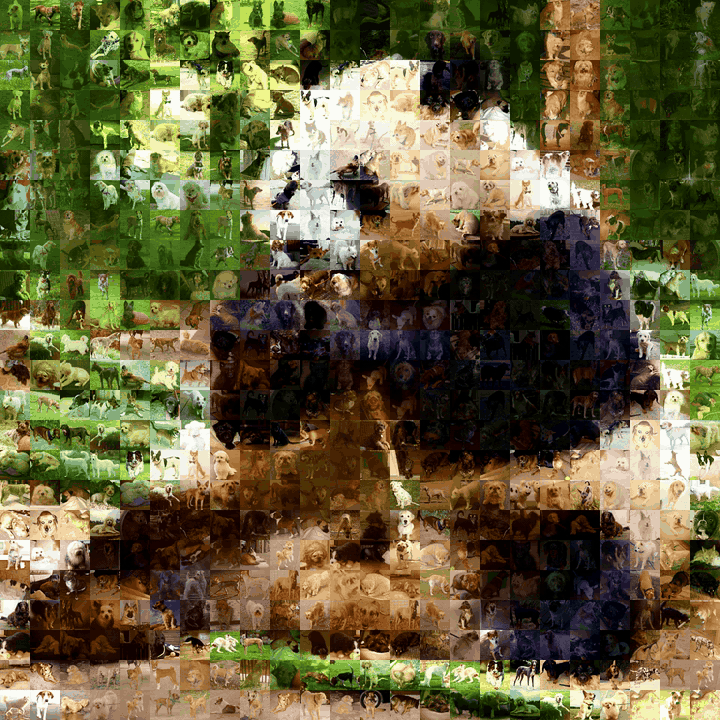
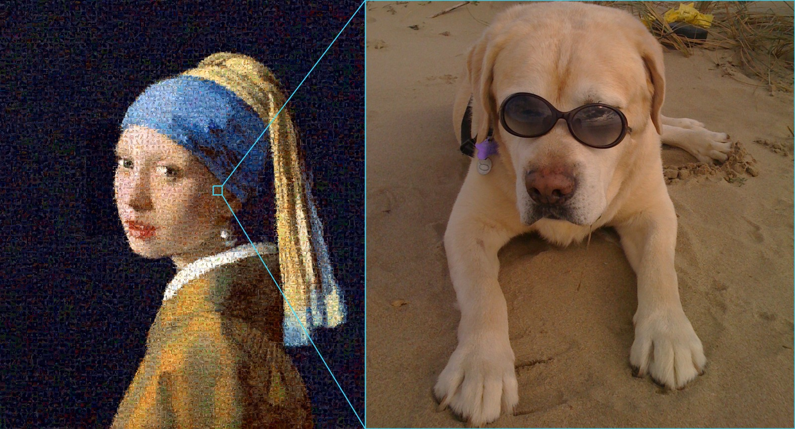
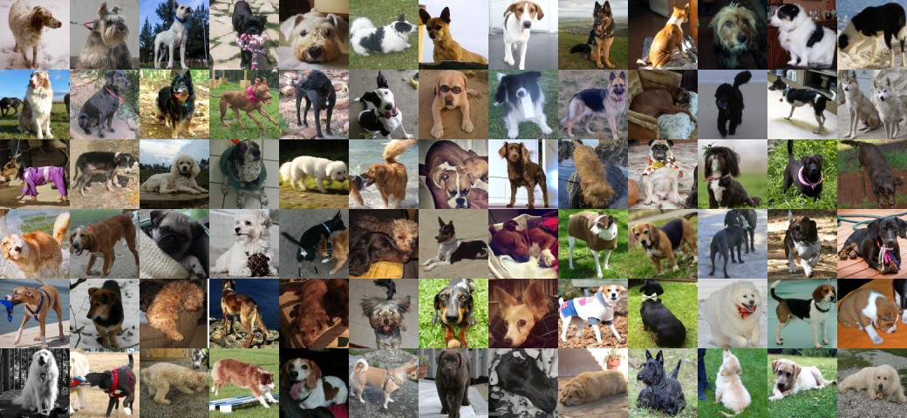

<h1 align="center">photomosaic-video</h1>

<p align="center">Still image: 2.3 s · 10 s of video: ~1 min · CPU only<br>
<sub>Ryzen 7 7735HS</sub><br>
Built mostly by AI. Check the results yourself.</p>

<p align="center">
<a href="https://colab.research.google.com/github/hinanohart/photomosaic-video/blob/main/docs/demo.ipynb"></a>
<a href="https://pypi.org/project/photomosaic-video/"></a>
<a href="LICENSE"></a>
</p>

<h3 align="center">576 tiles.</h3>

<p align="center">
  
</p>

<h3 align="center">5,440 tiles.</h3>

<p align="center">
  
</p>

---

## Install

```bash
pip install photomosaic-video
```

Python 3.10+. Video also needs ffmpeg.

## Use it

```bash
photomosaic-video --demo                    # try it, no downloads
photomosaic-video clip.mp4 -t ./dog         # a video
photomosaic-video portrait.jpg -t ./dog     # a still image
```

`-t` takes any folder of photos. Close-ups work best. All options: `photomosaic-video --help`

How it works: [HOW_IT_WORKS.md](HOW_IT_WORKS.md)

## Photos to build from

Ready-made packs (dog, cat, flower) are on the [Releases](../../releases) page.

<p align="center"></p>

## Credits & licence

Thank you to [flutie8211](https://pixabay.com/users/flutie8211-17475707/) (Pixabay) for the panda clip.

And thank you to every photographer behind the tiles — CC BY 2.0 photographs from Open Images V7,
listed in [dog](docs/credits-dog.md), [cat](docs/credits-cat.md), [flower](docs/credits-flower.md),
and `photomosaic_video/ATTRIBUTION.md` for the 919 bundled ones.

Code: MIT. Photos: CC BY 2.0 — if you publish a mosaic built from them, include the
`ATTRIBUTION.md` that came with them.
